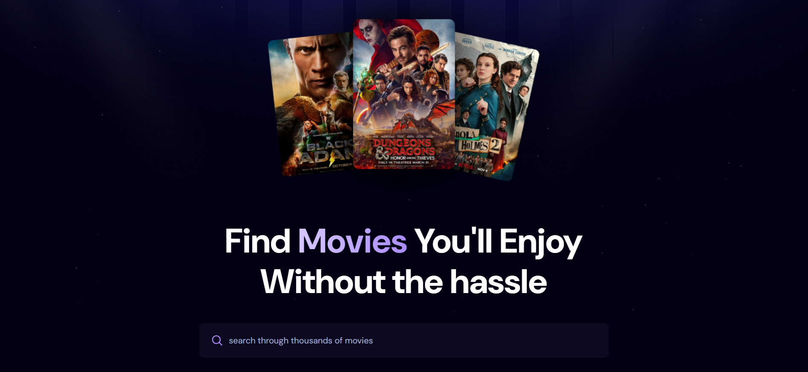

<h1 align="center">🎬 React Movie App</h1>

<p align="center">
  <em>My first React project after returning to coding during military service 🇪🇬</em><br>
  Built to refresh fundamentals, work with APIs, and experiment with Appwrite backend.
</p>

---

### 🧠 Tech Stack & Tools
<p align="center">
  
  
  
  
  
  
</p>

---

### 📸 Preview
<p align="center">
  
</p>

---

### 🚀 Features
- 🔍 Search movies through TMDB API  
- 💾 Store and track search terms using **Appwrite**  
- 🎨 Built with modern stack: React + Vite + Tailwind  
- 📊 Simple, clean, and responsive interface  

---

### ⚙️ Installation & Setup
```bash
# Clone the repo
git clone https://github.com/MagedKaram/react-movie-app.git

# Navigate to folder
cd react-movie-app

# Install dependencies
npm install

# Run locally
npm run dev
